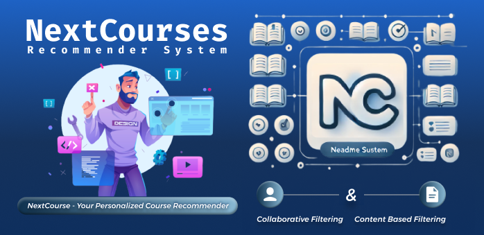

# NextCourses Recommender System (NC)

  <!-- Optional banner image -->

## Deskripsi  
NextCourses Recommender System adalah proyek pengembangan model rekomendasi kursus berbasis pembelajaran mesin yang dirancang untuk memberikan rekomendasi kursus yang relevan dan personal bagi pengguna. Sistem ini menggunakan dua pendekatan utama, yaitu Collaborative Filtering dan Content-Based Filtering, untuk mengoptimalkan pengalaman belajar pengguna melalui rekomendasi yang akurat.

## Struktur Proyek  
- **Dataset**  
  Berisi data interaksi pengguna sintetis dan metadata kursus dari platform Udemy.  
- **Model**  
  Terdiri dari dua metode rekomendasi:  
  - Collaborative Filtering (dengan model tuning menggunakan Bayesian Optimization)  
  - Content-Based Filtering (dengan model tuning grid search)  
- **Notebook**  
  Script Jupyter Notebook untuk preprocessing data, pelatihan model, dan evaluasi.

## Fitur Utama  
- Pemodelan interaksi pengguna sintetis untuk simulasi rekomendasi nyata  
- Hyperparameter tuning dengan Keras Tuner untuk optimasi performa model  
- Penyimpanan model dan bobot yang siap digunakan untuk deployment  
- Dapat diperluas untuk integrasi dengan platform pembelajaran online

## Teknologi  
- Python, TensorFlow/Keras  
- Keras Tuner untuk hyperparameter optimization  
- Pandas dan NumPy untuk manipulasi data

## Cara Penggunaan  
1. Muat dataset dan preprocessing dengan notebook `Generate_User_Id_(Synthetic_Data).ipynb`.  
2. Latih model Collaborative Filtering dengan `TFRecom_Collaborative_Filtering.ipynb`.  
3. Latih model Content-Based Filtering dengan `TFRecom_Content_Based_Filtering.ipynb`.  
4. Gunakan model hasil training untuk menghasilkan rekomendasi kursus.

**NextCourses**: Membantu pengguna menemukan kursus berikutnya yang tepat untuk pengembangan skill mereka.